  

<h1 align="center">Hi, I'm Ajaj Ali 👋</h1>

<h3 align="center">Applied AI Engineer — GenAI · Voice AI · RAG · Agentic Systems</h3>

  

  
  
  
  

  
  
  

---

### 🚀 About Me

I'm an **Applied AI Engineer with 2+ years of experience** building production-scale **LLM, RAG, Voice AI, and Conversational AI** systems. Currently a **Data Scientist at Oriserve**, where I design and ship real-time speech-to-speech pipelines, TTS infrastructure, multi-agent reasoning systems, and scalable inference architectures for enterprise clients including **IndiaFirst Life Insurance, Ikea, Metropolis, and Indigo**.

- 🔭 Currently building next-gen **streaming Speech-to-Speech (S2S)** architectures and full-duplex spoken dialogue systems
- ⚡ Engineered a production S2S pipeline with **sub-1s response time** and **80% reduction in operational cost**
- 🧠 Built a production-grade **ReAct (Observe–Reason–Act)** agent architecture for enterprise knowledge retrieval, using dynamic context pruning, tool calling, and multi-hop reasoning
- 🗣️ Shipped a multilingual **TTS system supporting 17 Indian languages** with real-time streaming, deployed on Hugging Face Spaces
- 📚 Scraped and processed **60,000+ documents and audio samples** to build training data and knowledge bases for LLM/TTS/STT models
- 🎓 B.Tech in Computer Science, Kurukshetra University (2020–2024)

---

### 🧰 Tech Stack

**GenAI / LLM / Agentic AI**

**Voice AI / Speech**

**ML / DL Frameworks**

**Serving / Infra / MLOps**

**Data**

---

### 📌 Featured Projects

| Project | Description | Stack |
|---|---|---|
| **[OriTTS – Multilingual Voice Generation](https://huggingface.co/)** | Production-grade multilingual TTS supporting **17 Indian languages** with natural prosody and real-time streaming, deployed via Hugging Face Spaces. | TTS, PyTorch, Streaming |
| **[Text Preprocessor for TTS](https://github.com/Ajaj-Ali/text_preprocessor_for_TTS)** | Configurable text-normalization pipeline for multilingual TTS — numbers, dates, currencies, symbols, abbreviations — improving pronunciation and synthesis quality across English & Indian languages. | Python, Regex, NLP |
| **[ARIA — Audio Responsive Intelligent Assistant](https://github.com/Ajaj-Ali)** | Multilingual Voice AI assistant with real-time streaming conversation using Faster-Whisper, Ollama (Qwen2-7B), and XTTS, with automatic language detection and token streaming over a custom Django Channels backend. | Django, WebSockets, Faster-Whisper, XTTS |

> 💡 Replace the OriTTS and ARIA links above with their exact URLs once you confirm them — I linked what I could verify and placeholder'd the rest so nothing points to the wrong place.

---

### 📊 GitHub Stats

  
  

  

---

### 📫 Let's Connect

  <a href="https://www.linkedin.com/in/ajaj-ali/">LinkedIn</a> ·
  <a href="mailto:ajajali7534@gmail.com">Email</a> ·
  <a href="https://huggingface.co/">Hugging Face</a>

